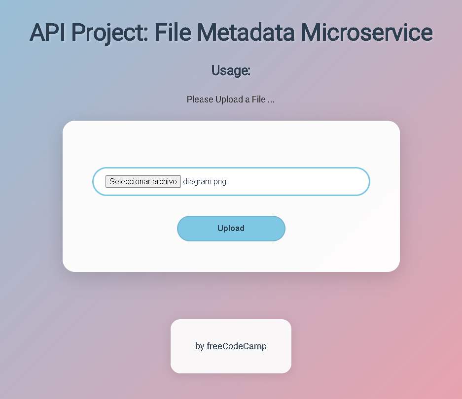

# File Metadata Microservice

Este proyecto es una API para el reto de freeCodeCamp "File Metadata Microservice". Permite subir un archivo y devuelve información básica sobre el mismo (nombre, tipo y tamaño).

## Vista previa de la aplicación web



## Diagrama de la solución


## Tecnologías utilizadas
- Node.js
- Express
- Multer
- Cors
- Dotenv

## Instalación

1. Clona este repositorio o descarga los archivos.
2. Instala las dependencias:
   ```sh
   npm install
   ```

## Uso

1. Inicia el servidor:
   ```sh
   npm start
   ```
2. Abre tu navegador y ve a `http://localhost:3000`.
3. Sube un archivo usando el formulario web.
4. Recibirás una respuesta JSON con la información del archivo:
   ```json
   {
     "name": "nombre_del_archivo.ext",
     "type": "tipo/mime",
     "size": 12345
   }
   ```

## Endpoints

- `POST /api/fileanalyse`
  - Recibe un archivo en el campo `upfile` (formulario `multipart/form-data`).
  - Responde con un objeto JSON con el nombre, tipo y tamaño del archivo.

## Notas
- No se requiere base de datos.
- Multer se usa para procesar la subida de archivos.

---

Proyecto para [freeCodeCamp](https://www.freecodecamp.org/).
